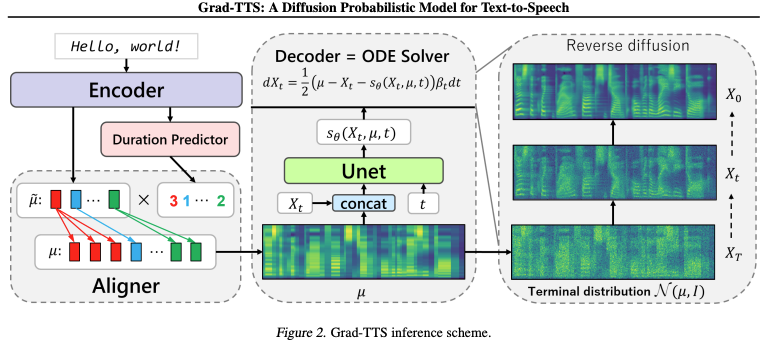

import VowelSynthesizer from '../../components/VowelSynthesizer.tsx';
import SawtoothGenerator from '../../components/SawtoothGenerator.tsx';

## Introduction

**This article is a work in progress, I will continue to update this continuously as time goes on**

This article provides an introduction to some recent developments in speech synthesis, specifically focusing on DDSP-based approaches. This article is intended for those not necessarily in the domain of audio signal processing. Readers should generally be familiar with basic concepts in deep learning, neural networks, and some applied knowledge in libraries such as PyTorch.

## Introduction to Speech Synthesis

Speech synthesis is the process of generating speech given some input. Like early neural networks, which were grounded in theories of the human brain and perception, early speech systhesis were biologically inspired by theories in linguistics of human vocal production.

These modeled the process of speaking as a digital signal processing task, where the vocal flaps produce some signal that goes through some series of filters and other processing to produce the final audio waveform.

## Interactive Vowel Synthesis Demo

To better understand how formant filtering works in speech synthesis, try this interactive demo below. It uses Web Audio API to simulate the vocal tract with bandpass filters that represent different formants (resonant frequencies) of vowels.

<VowelSynthesizer client:load />

## How It Works

The synthesizer models three key components of human speech production:

### Excitation Source: The Sawtooth Wave

The synthesis starts with a **sawtooth wave** oscillator, a waveform that sounds harsh and buzzy on its own, but is rich in harmonics (multiples of the fundamental frequency). Think of it as a raw "buzz" that contains many frequency components simultaneously:

$$
x(t) = \sum_{n=1}^{N} \frac{\sin(2\pi n f_0 t)}{n}
$$

This mimics the sound produced by your vibrating vocal folds before any shaping by your mouth and throat. The pitch slider controls the fundamental frequency (f_0), typically 100-120 Hz for male voices, 200-220 Hz for female voices. The sawtooth is ideal because its rich harmonic content gives the formant filters plenty of frequencies to work with.

# WARNING: TURN YOUR VOLUME DOWN, THE RAW SAWTOOTH IS VERY LOUD

<SawtoothGenerator client:load />

 

The sawtooth wave then passes through three bandpass filters connected in series (a cascade):

$$
\text{Sawtooth} \xrightarrow{\text{Filter 1}} \xrightarrow{\text{Filter 2}} \xrightarrow{\text{Filter 3}} \text{Vowel}
$$

This cascade mimics how sound propagates through your vocal tract,a tube with multiple resonant cavities (throat, mouth, lips) that each emphasize certain frequencies while dampening others. Each filter in the cascade adds a formant,a peak in the frequency spectrum at a specific frequency.

### Bandpass Filter Response

Each filter is a bandpass filter tuned to a specific formant frequency that amplifies frequencies near its center frequency ($f_c$), attenuates frequencies far from the center, and has a bandwidth that controls how selective it is

The filter's frequency response looks like a bell curve centered at the formant frequency:

$$H
H(f) \approx \frac{1}{1 + Q^2\left(\frac{f}{f_c} - \frac{f_c}{f}\right)^2}
$$

The Q factor (quality factor) controls how "sharp" this peak is:
- High Q (10-20) = narrow peak = "tense" or clear vowel
- Low Q (5-8) = wide peak = "breathy" or relaxed vowel

When all three filters work together, they create a spectrum with three distinct peaks—the formants that our ears recognize as specific vowels.

### The Three Formants

Each bandpass filter emphasizes a different frequency band:

- **F1** (First formant, ~300-800 Hz): Controls vowel height (high vs. low)
- **F2** (Second formant, ~800-2500 Hz): Controls vowel frontness (front vs. back)  
- **F3** (Third formant, ~2000-3500 Hz): Adds naturalness and speaker characteristics

Every vowel has a unique combination of these three formant frequencies. For example:
- /i/ ("ee" in "beet"): F1=270 Hz, F2=2290 Hz, F3=3010 Hz
- /ɑ/ ("ah" in "father"): F1=730 Hz, F2=1090 Hz, F3=2440 Hz

### Parameter Mapping

The demo's sliders control these formants in intuitive ways:

- **Front ↔ Back**: Primarily adjusts F2 (and F1 slightly)
- **High ↔ Low**: Primarily adjusts F1 (and F2 slightly)
- **Gender**: Scales all formants uniformly (shorter vocal tracts = higher formants)
- **Voice Quality**: Adjusts filter bandwidth (Q factor)—narrow for "tense" vowels, wide for "breathy" sounds

The State Variable Filter implementation uses smooth parameter interpolation to prevent clicking artifacts as you move the sliders:

$$
g = \tan\left(\frac{\pi f_c}{f_s}\right), \quad Q = \frac{f_c}{BW}
$$

where $f_c$ is the formant frequency, $f_s$ is the sample rate, and bandwidth (BW) determines selectivity.

## From Formants To Words

We will not cover how consonants are generated, but historically they can be generated via a similar filtering process, although can differ in the way they interact with the harmonics, as some consonants are much more related to percussion (e.g., plosives like /p/ and /t/), rather than voiced harmonics which stem from the vocal folds.

Once we have a way of generating each of these sounds, we can then essentially map text to speech by converting text into a sequence of these generated sounds. In practice, there are many more details to make things sound more natural, such as defining prosity on differn punctuation, words, and relationships between different sounds.

We see that the end result of this process (as seen in the above demo), are sounds that are inteliigible, but robotic and unexpressive. You may have noticed that some combinations of parameters resemble Perfect Paul, the TTS voice used by Stephen Hawking.

With this in mind, there are several challenges and questions in building a more sophisticated speech synthesis system. This includes making softer voices, onces that are less monotone, and can perhaps even simulate emotion. We however see that in this rather simple formant synthesis task, we had quite a few parameters, and each of them had to be hand tuned and known before-hand. To make a desired voice requires more complexity for expressability, as well as finding relationships between these parameters to create more natural and varied speech patterns.

## Modern Neural Approaches 

Rather than manually tuning each parameter, modern neural approaches can learn these mappings automatically from large datasets of audio and text pairs. This is easier said than done.

### Diffusion Based Approaches: Grad-TTS

As of writing this, the most powerful speech models make use of [flow matching](https://arxiv.org/abs/2210.02747). Flow matching is an enticing alternative to diffusion models, with new models such as CosyVoice demnostrating superior latency, controlability, and stability. For the purposes of this demo, we will focus more on diffusion models, as they are more commonly understood, and better demonstrate the need for DDSP-based approaches.

**Grad-TTS** Published in 2021 by [Popv, Vovk et al](https://arxiv.org/pdf/2105.06337) offered state-of-the-art performance on TTS tasks at the time of publication.

Diffusion probability models allow for us to generate audio that can emulate realistic voice without so much hand tuning. Because spectrograms are essentially images that represent speech, this process can be viewed very similarly to diffusion on images, where we have some input image, we iterativly add noise, then perform a denoising process. Mathematically this can be modeled as:

$$dX_t = (1/2)\Sigma^{-1}(\mu - X_t)\beta_t dt + \sqrt{\beta_t} dW_t, t \in [0, T]$$

Where: 
- $X_t$ represents the mel-spectrogram at time step $t$
- $\mu$ is the mean vector (aligned encoder output)
- $\Sigma$ is a diagonal covariance matrix
- $\beta_t$ is a noise schedule function (typically linear)
- $W_t$ is a standard Brownian motion (If you are not familiar with browning motion, just think of it as a source of noise in this context)

We can understand the $dX_t = (1/2)\Sigma^{-1}(\mu - X_t)\beta_t dt$ term as a normalizing term and the right term as the term responsible for adding noise. As this process runs, we move from something resembling our spectrogram, to the normal distribution $\mathcal{N}(0\mu,\Sigma). It is provable that converge nce holds regardless of $X_0$, making this a robust process for converting our inputs to some noisy distribution.

Simmilarly we have a reverse diffusion process defined by:

$$dX_t = (1/2 \Sigma^{-1}(\mu - X_t) - \nabla log p_t(X_t))\beta_t dt + \sqrt{\beta_t} d\tilde{W}_t, t \in [0, T]$$

Where $\tilde{W}_t$ is a reverse-time Brownian motion and $p_t$ is the probability density function of $X_t$.

The idea here is that if we a good way of estimating the $\lambda \log p_t(X_t)$ term, then we have a good idea of what the distribution of the original $X_0$ looks like. That is because this term poinyd in yhr fitrvyion of maximum increase of log-density, meaning that if we have a perfect estimation of this term at every timestep, we are able to fully recover the original $X_0$. Therefore, if we have a neural-network that can make these types of predictions, we are able to get an understanding of $X_0$'s distribution by sampling from $\mathcal{N}(\mu, \Sigma)$, then performing the reverse, diffusion process.

The loss function is given by

$$\mathcal{L}t(X_0) = E_{\epsilon_t}[||s_\theta(X_t, t) + \lambda(\Sigma, t)^{-1}\epsilon_t||^2_2]$$

Where:
- $s_\theta(X_t, t)$ is the neural network that estimates the score
- $\epsilon_t$ is sampled from $N(0, \lambda(\Sigma, t))$
- $X_t = \rho(X_0, \Sigma, \mu, t) + \epsilon_t$

The left term is our prediction of the gradient term in the reverse diffusion process. The right term is a sort of ground-truth of the gradient term, this is derived explicitly from the paper, and can be done so by explocitly solving the forward diffusion differential equation.

But where do these $\mu$ and $\Sigma$ terms come from in practice? what do they mean?

In the context of Grad-TTS, $\mu$ is the model's text-conditioned prediction of the final mel-spectrogram. It acts as a guide or a "noisy target" for the diffusion decoder. This term is derived by splitting up a text sequence of phonemes/characters, and aligns them in a way that encodes their duration. Instead of starting from pure random noise, the reverse diffusion process starts from noise that is already centered around this $\mu$. What this means in the forward diffusion process is that we take some speech, and move it towards some distribution that represents utterances of simmilar semantic meaning. Therefore, the reverse diffusion process generates speech, starting from a valued sampled from this text-encoded space.

As for the $\Sigma$ term, this is less semantically important. The authors end up just setting this as the identity, making it so noise is added in a symmetrical way.

Putting everything together, the authors end up with a model that has very powerful speech synthesis capabilities, however, due to the computational complexity of the diffusion process, the model has some issues with both latency and memory. Doing a single process means we have multiple passes of the network, and because out output is a spectrogram, we need a seperate vocoding process such as [Hifigan](https://arxiv.org/abs/2010.05646) (Kong et al., 2020) to convert it into audio. While other faster neural-vocoders can be used for this last part, HiFi-GAN was used by the authors due to its high-quality outputs.

Putting this all together, we see we can create realistic speech by training on different voices, however the nature of diffusion provides a computational challange for us to overcome

TODO: DDSP, maybe expend on diffusion more

